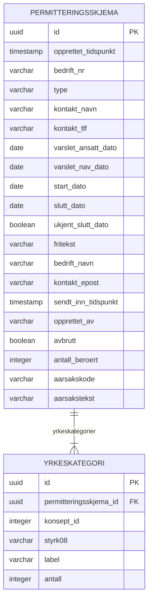

Datavarehus ønsker et ER-diagram for vår datamodell. 
Følgen er basert på de tabellene som er relevant for kafka-meldingene.
Skjemaet deles med datavarehus her: https://confluence.adeo.no/pages/viewpage.action?pageId=553645854

